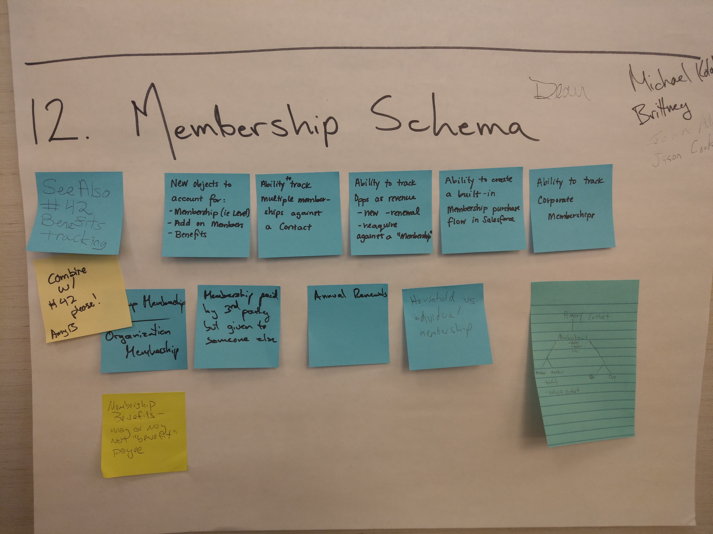

### Membership Schema And Benefits

### Project Team
Help us give you the thanks you deserve! Please ensure that all contributing members of the team are included!
* Team Leader(s): 
* GitHub Scribe(s): Thomas Taylor (@tet3)
* List of all Contributors: Andrea Hanson, Dean Graham, John Adams, Deepa Bedi, Jon Varese, Shari Carlson Reily, Michael Kolodner, Brittany Neale

### Project Vision (Your first task as a team)
A schema for memberships, renewals, payments, multiple members, families, benefits, etc, that actually works. Eventually automation etc.

* What is the big problem that your project is trying to solve?
    The existing NPSP membership data model is very lightweight and doesn't meet many orgs' needs. We seek to design a data model that is flexible and extensible for a wide range of membership models. 

* Who will be using your project?
    Organizations that have paid memberships of some kind. 

* A year from now, how do you see people describing your project?

Use these questions to form a clear vision statement of 3-5 sentences (rough guideline). 

Having trouble? Salesforce.org staff and your fellow sprinters are here to help! Use one of your table's request signs and/or post in the Quip Chat to seek help, and we'll pop by.

### Requirements

* Track retention, renewal and reacquire
* 

### Project Resources

* Indicate if there are any existing Hub Ideas, or product Issues/Bugs that you're solving for. 
* Where can we find additional information on your project? Ie. do you have supporting code in another Repo, do you have documentation in Google, your repo's Wiki, etc.? Be sure to include (or at least links to) all supporting material here. If it's not in your project Repo, it will get lost.

### Project Team Accomplishments
What did the Project Team accomplished during the Sprint?

### Future Contributions (AKA what were you unable to finish at the Sprint)
Often, it takes multiple Sprints to contribute an idea back into the Community. What happens at a Sprint does not stay at a Sprint! If someone were to contribute to this project at the next Sprint what would you want them to work on to move this project forward?  
* What is your project's Roadmap?

**Important**: If you have specific asks to help move this project forward we would recommend that you list them here, but also create separate Issues for each and add the label of "help wanted". This is a well-worn best practice for projects living in GitHub.