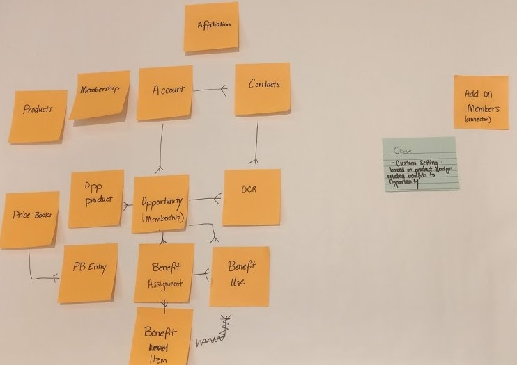

### Membership Schema And Benefits

### Project Team (March 31, 2020)
Help us give you the thanks you deserve! Please ensure that all contributing members of the team are included!
* Team Leader(s): Kai Williams
* GitHub Scribe(s): [Collin Zimmerman](/collinzimmerman)
* List of all Contributors: [Evan Ponter](/RealEvanPonter), [Reede Stockton](/npsp-reedestockton), James Browne, [Mel Brockley](/MellifluousBee), [Chris Pifer](/selfuntitled)

### Project Team (Previous Sprint)
Help us give you the thanks you deserve! Please ensure that all contributing members of the team are included!
* Team Leader(s): 
* GitHub Scribe(s): [Thomas Taylor](/tet3) & [Duncan McGovern](/D-McGovern)
* List of all Contributors: [Andrea Hanson](/andreahanson), Dean Graham, John Adams, Deepa Bedi, Shari Carlson Reily, [Michael Kolodner](/mkolodner), Brittany Neale, Amy Bucciferro

### Project Vision (Your first task as a team)
A schema for memberships, sponsorship, renewals, payments, multiple members, families, benefits, etc, that actually works. Eventually automation etc.

* **What is the big problem that your project is trying to solve?**
    The existing NPSP membership data model is very lightweight and doesn't meet many orgs' needs. We seek to design a data model that is flexible and extensible for a wide range of membership and entitlement models including memberships and sponsonships. 

* **Who will be using your project?**
    Organizations that have any form of membership or sponsorship, paid or unpaid. 

* **A year from now, how do you see people describing your project?**
    A foundational data structure that can be extended and modified

* **Use these questions to form a clear vision statement of 3-5 sentences (rough guideline).** 
The team would like to provide nonprofits and consultants with a framework for benefits including memberships and sponsorships that is separate from opportunities for both technical and operational considerations. These include benefits that are not tied to a financial contribution as well as the ability expose benefits objects to all SF license types (community, platform, etc). It also decouples purchasing a benefit from the benefit recipient(s).

Having trouble? Salesforce.org staff and your fellow sprinters are here to help! Use one of your table's request signs and/or post in the Quip Chat to seek help, and we'll pop by.

### Requirements
We've reviwed the list of requirements and confirmed that the model fits. Notes below

**Membership**
* Track memberships or distinct types of memberships
    * "Membership" object can encompass membership as well as sponsorship. And provides a high-level overview of allocated benefits and usage of those benefits
    * Record Types could be used for define sponsorships, benefits, and other specific distinctions
* Track retention, renewal and reacquire
    * Custom fields for dates and statuses on custom object
    * automate labeling of membership opps as new, renewal, reacquire (Could be a future project)
 * Individual memberships
    * Tracked w/ Membership object + Membership contact role junction object
 * Dual & Household memberships
    * Supported using one Membership object and a Contact Membership Role object for each "member" or recipient
 * Organizational memberships
    * Multiple Contacts attached to a membership, not necessarily tied to the same Account from opportunity or membership
    * Supported via Contact membership role
    * Membership can be assigned to specific or additional contacts - relevant for Organizational membership that grants membership to a specific number of members
    * Supported because Memberships don't flow down to Contacts via Account; Affiliations could be leveraged to automate if desired
* Memberships without payment, eg, gift memberships & subscriptions
    * Benefit does not need to be linked to an Opportunity
    * Free memberships
* Easily allow interal Salesforce users to create membership orders from an opportunity or create memberships directly
* Membership levels & products
    * Retains current flexiblity to use either a membership picklist on Membership (rather than Opportunity) or use various record types or Products to track this
* Keep track of multiple memberships assigned to a single contact
    * could be multiple active memberships
* Personal Membership/non-tax deductible amount
    * Flexiblity to use either Opportunity or Opportunity Product for this
* acknowledgements & receipting
    * Payment acknowledgement/receiting continutes to be handled on the opporutnity
* membership card or other notifications
    * Optional businss process
    * Emails could be created or automated based on the Membership object attributes
* automate renewal creation and reminders
    * Optional based on business processes (could automate this in many ways internally); not part of the initial package
    * automate renewal reminder emails
* marking memberships as lapsed
    * End date field on Membership object
* grace period 
    * Defined by business process/future requirement
    * See periodic/recurring payments requirement below
* multi-year memberships
    * Defined by business process/future requirement
* membership # associated with Contact(s)
    * Optional business process, could live on Membership Contact Role, Contact, Account, or custom object
* suspending / cancelling memberships
    * Could suspend either at Membership level (using picklist or setting the end date) or at Membership Contact Role
    * could automate using Affiliation status for business (if organization member has organization membership and then leaves organization)
* periodic/recurring payments for memberships
    * Payments are separate from memberships
    * Can be handled on Opportunity with Payments, or even Recurring Donations (utilizing NPSP)
    * suspension of membership if recurring payment missed (Optional; could be automated/future)
* Communities compatibility/automation
    * Supports all licenses
    * Membership records are decoupled from Sales Cloud object
    * Deactivate community user if their membership expires/terminates/lapses

**Benefits**
* Overlapping membership levels, especially re: discounted levels like Senior or Student 
    * This is a business process decision to be made by the organization; could assign additional Benefit Items based on org business process. Example: senior + student discount; can be assigned additional Benefits Item; Benefits object could have a senior/student level picklist or simply choose one over the other, could use discouting in Opportunity Products.
* tying benefits to specific events, eg, seats, ads
    * Have flexiblity to connect
    * Could create a lookup relationship from benefit to campaign
    * Membership comes with 10 course discounts per year. Wanted to keep track the total discounts used.
* differentiate between membership benefit entitlements and actual receipt of benefits
    * Optional "benefits use" object could be built or simply use picklist on benefit item
* track if member declines benefits - relates to tax-deductibility as well
    * Could be supported according to business processes
* benefits over longer period of time, including over multiple events
    * Supported
* Benefit/purchase rollovers - yes, could be moved to another Benefits object
    * status in benefit Assignment - yes, could be picklist or additional object
* Different benefits -> new vs. renewing 
    * business process decision

## Requirements to refine
* BDI considerations 

### Ongoing concerns
* Complexity of the model
    * LDV performance issues
    * End-user friendliness
    * Distance between Contact and Benefits
* Rollups

### Solutioning
* [Current model V4](https://drive.google.com/file/d/1zu1199WF7od-WmdEsRz2L1fSsu5cxvqJ/view?usp=sharing)
    * focuses on addressing membership concerns
    * Membership object provides:
     * clarity/flexibility (as opposed to reusing another object with a confusing name and limitations - OCR or OppProds)
     * start/stop dates for membership period
     * ability to relate to an account (household or organization) and/or one/multiple contacts
    * Opportunity Product object provides:
     * details of each purchase as part of a transaction on the opportunity
     * ability to bundle orders of various products (donations, memberships, etc) on one opportunity
     * ability to renew a single membership record on a future opportunity (multiple OppProds can specify one membership)
     * ability to reference product pricing, add discounts
    * GAU Allocation object:
     * needs to be considered if we plan to allow a bundle opportunity where a dontion and membership are purchased together
     * provides summarized financial information relevant to accounting departments

Previous Data Models:
* [Previous model V3](https://drive.google.com/file/d/16nSpkvJ8fAAVRhX-rB-gPlWMUBXnfjc1/view?usp=sharing)
    * addressed LDV concerns; allows all benefits to be viewed in a single related list connected to Account
    * re-used Benefits object for both big picture things like Membership as well as more specific line items
    
* [Previous model V2](https://drive.google.com/file/d/0B4VvMV3AXIz1NDJUNW5RY0pnUDNVY3VsZXo1ZFZXTV9lamVZ/view?usp=sharing)
    * Reduced number of objects

* [Draw.io ERD](https://www.draw.io/?lightbox=1&highlight=0000ff&edit=_blank&layers=1&nav=1&title=MembershipSchema-PhillySprint.drawio#Uhttps%3A%2F%2Fdrive.google.com%2Fa%2Fcoolbrook.org%2Fuc%3Fid%3D1UGZOsbNlRQTadTfOZhl7pvLYH-NQnRqz%26export%3Ddownload)

* Benefits (or "membership/sponsorship" object)
    * Struggling to name this—it's confusing
    * Lookup to itself in order to create a hierarchy to relate for example benefit items to one membership purchase
    * OOTB Membership and Sponsorship RT
     * Probably want a 3rd "Item" RT that designates the child Benefits
    * Stores "type" information (purchased, gifted, awarded)
    * Designated Primary contact - creating a BCR for this Contact recommneded as the first automation
    * Start Date
    * End Date
    * Sponsorship Type
    * Member Level
    * Status - optional?
 * Benefit Contact Role (for lack of a better name) - probably will only pertain to Membership RT but flexible
    * Junction record between Contact and Benefit
    * Shows history of membership
* Benefit Offering
    * Catalogue of specific things an organization might give as part of a membership or sponsorship. Parent of Benefit

## Next Steps
* Use cases / user stories
* Prove out on model - in progress
* Firm answer on the membership and its junction
* Define MVP and Roadmap
* List edge cases we will not support
* List custom settings/automation to prioritize

## Code
* Custom setting (or metadata) : based on product, assign related benefits to Opportunity
    * for future
  
### Project Resources

* [Current NPSP functionality docs](https://powerofus.force.com/s/article/NPSP-Working-with-Memberships)
* Possibly related Hub Ideas:
  *   [Automate Membership Origin and Start/End Dates on new Opportunities](https://powerofus.force.com/s/idea/a1W80000004DUjLEAW/automate-membership-origin-and-startend-dates-on-new-opportunities)
  *   [Customize payment automation by stage](https://powerofus.force.com/s/idea/a1W80000006bnfMEAQ/customize-payment-automation-by-stage)
* Code hasn't yet been created
* Also see prior sprint work done during Amsterdam Sprint in 2019 https://github.com/SFDO-Community-Sprints/Membership-Management

### Project Team Accomplishments
* Reduced data model to 3 objects
* Many, many discussions that all return to the same core data model
* Feeling confident in creating a junction object between contact and membership
    * slightly less confident in how to address benefits

### Future Contributions (AKA what were you unable to finish at the Sprint)
* Write use cases
* Build proof of concept
